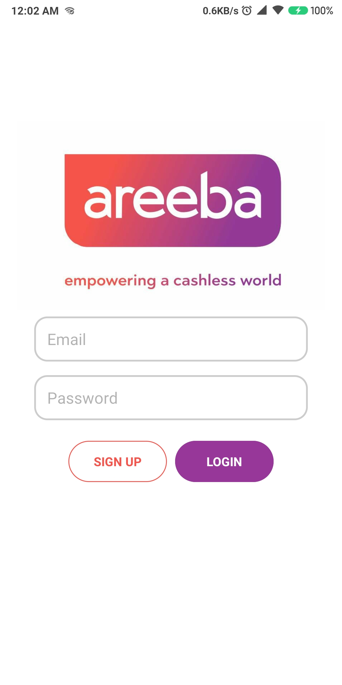
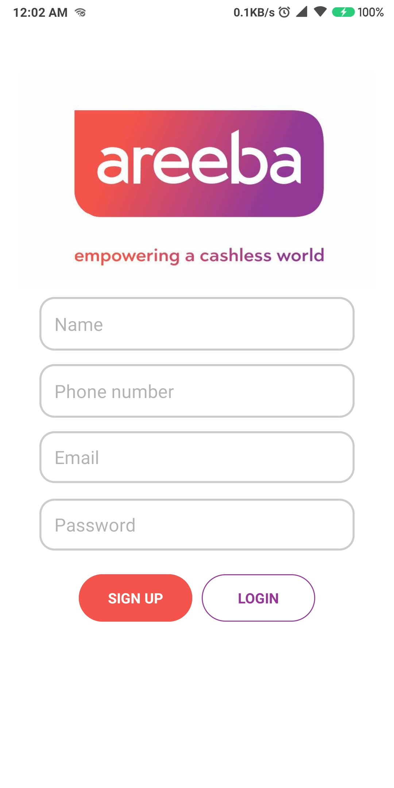
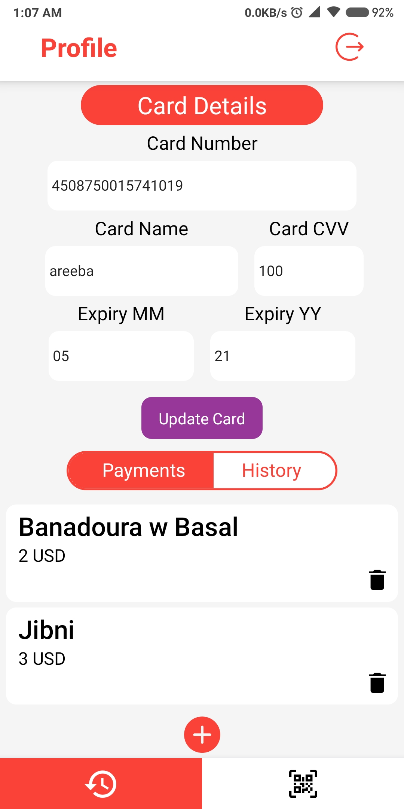
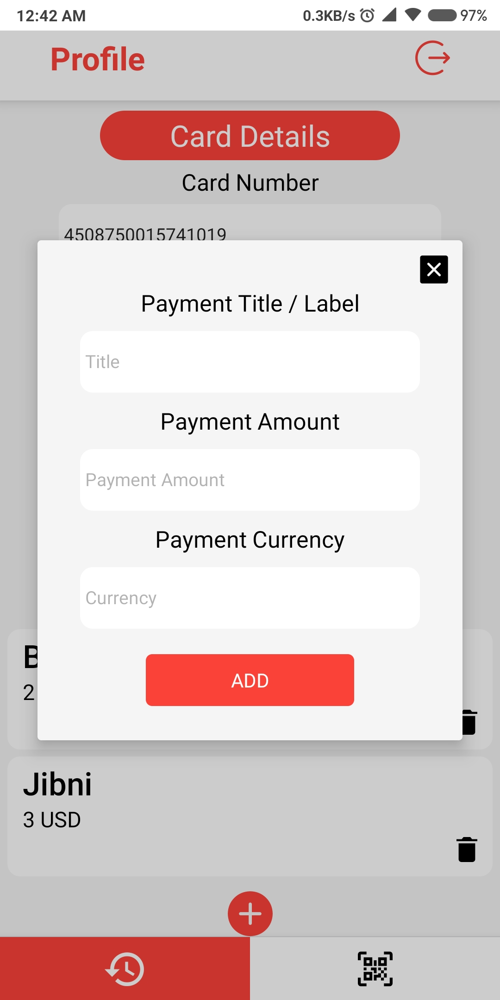
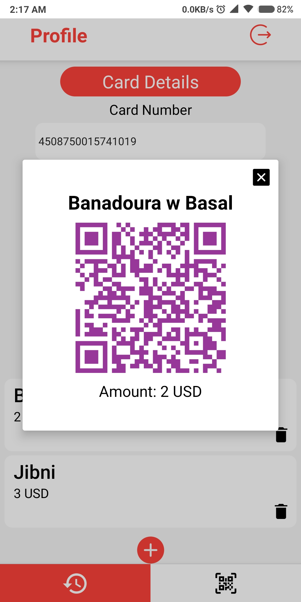
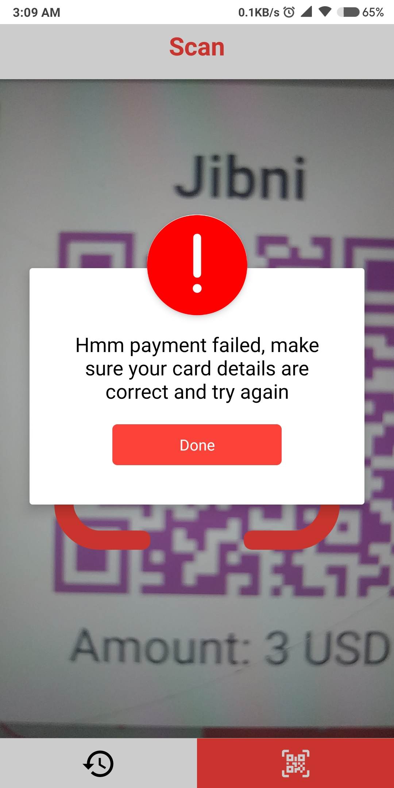
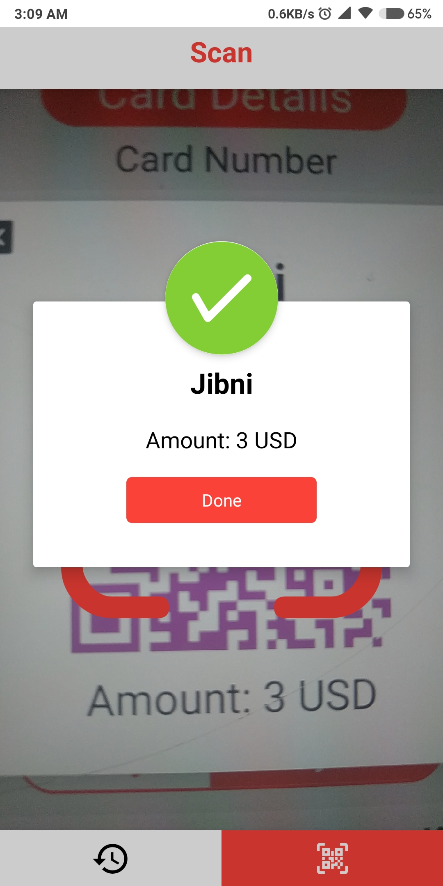

# areeba-hackathon (1st Challenge)

**Instructions**:

1) In the `react-native-app` folder:
  - open file `redux/reducers.js` and change the `url` variable in the `INITIAL_STATE` object to your IP (where you'll run the node server)
  - run `npm i`
  - run `npm start` and keep this terminal window running
  - In a new terminal, connect your device and run `react-native run-android`

2) In the `nodejs-app` folder:
  - run `npm i`
  - run `node index.js`

you must have mongodb service running on your machine (If on a port other than 27017, change it in `nodejs-app/config/development.env`)

Note: only tested on android using a linux machine.

Oh and, I'm interested in an internship as a senior uni student :p

## Screenshots

